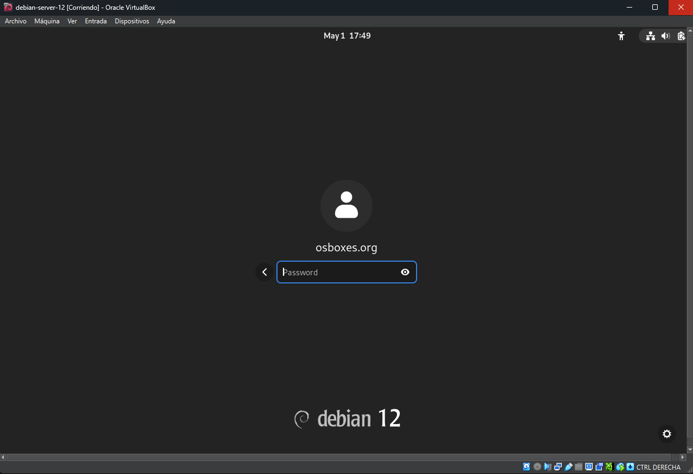
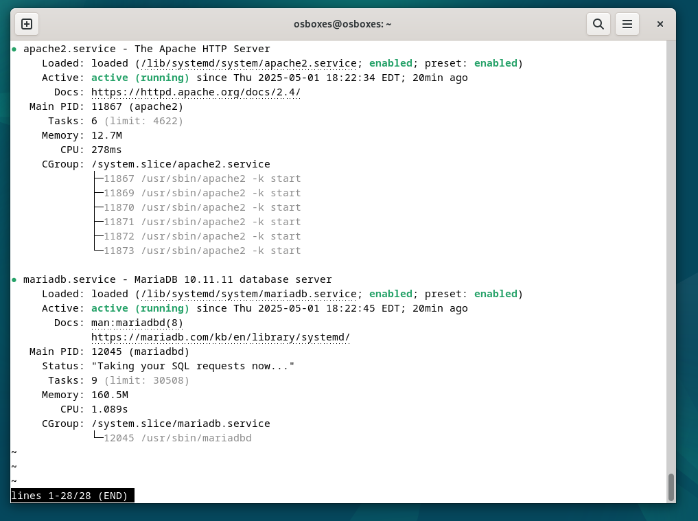
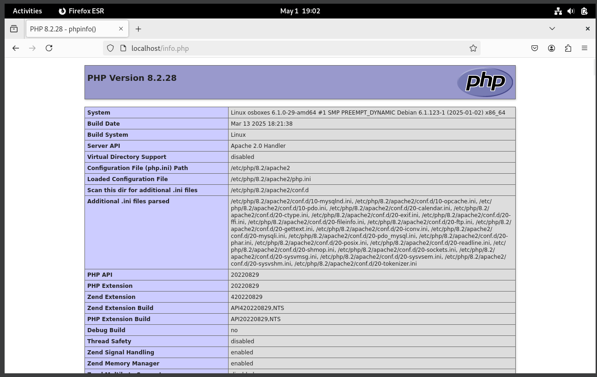

# Virtualización de linux Debian 

## Descargar Virtual Box y Linux Debian
 - Descargar e instalar el software Virtual box : https://www.virtualbox.org/wiki/Downloads
 - Descargar Linux Debian : https://www.osboxes.org/debian/

## Instalar Linux Debian en VirtualBox

  Dando por supuesto que ya dispones en tu PC de un VirtualBox, tan solo tienes que seguir estos pasos:

1. Descargar de la web de OSBoxes la máquina virtual de la distribución Linux que desees (dentro del amplio menú de «sabores» que se te ofrecen) y descomprimir el archivo descargado (es un ZIP) en la carpeta en la que tengas todas tus máquinas virtuales (o donde creas conveniente, claro).

<p align="center">

</p>


2. Abre VirtualBox y crea una nueva máquina virtual. 

<p align="center">

</p>


3. Cuando se te pregunte por el disco duro selecciona la última opción “utilizar un fichero de disco virtual existente”; busca el que descargaste y asígnaselo.

<p align="center">

</p>

4. Arranca tu nueva máquina virtual. Verás que existe un usuario ya creado llamado osboxes La contraseña es osboxes.org (está indicada en la página de OSBoxes desde donde has descargado tu nueva máquina virtual).

<p align="center">

</p>


## Instalar LAMP en Debian

### Requisitos

Antes de instalar la pila LAMP en Debian 12 Bookworm
Para poder completar los pasos de esta guía de instalación de la pila LAMP en Debian 12 Bookworm deberías cumplir los siguientes requisitos mínimos:

- Un sistema Debian 12 Bookworm actualizado.
- Acceso a consola con un usuario con permisos de sudo.
- Conexión a Internet.

Como seguramente cumples todos estos requisitos básicos, es hora de regular la altura de la mesa a la posición más cómoda, abrir nuestra terminal de comandos favorita y empezar a trabajar.

Cuando hablamos de instalar la pila LAMP en Debian 12 Bookworm nos estamos refiriendo a acomodar en nuestro sistema el servicio web Apache con el lenguaje de programación PHP integrado y un motor de bases de datos MariaDB/MySQL.

### Instalación de LAMP en Debian

El primer paso de este proceso será actualizar la información de los repositorios:
```
~$ sudo apt update
```
Si vas a usar la versión de PHP incluida en Debian 12, instala los componentes de la pila LAMP con este comando:
```
~$ sudo apt install -y apache2 libapache2-mod-php php-mysql mariadb-server
```
Una vez descargados estos paquetes y sus dependencias dispondremos de un par de servicios nuevos en Debian 12, los servicios apache2 y mariadb. Estos servicios quedan iniciados corriendo en segundo plano y habilitados para su inicio automático en cada arranque del sistema.

Podemos comprobar el estado de estos servicios con el comando systemctl:
```
~$ systemctl status apache2 mariadb
```

<p align="center">

</p>

### Cómo probar la pila LAMP en Debian 12 Bookworm
Con todos los servicios de la pila LAMP funcionando en Debian 12 es fácil comprobar su funcionamiento a través de una pequeña página web realizada en PHP.

Crearemos el siguiente archivo:
```
~$ sudo nano /var/www/html/info.php
```
El contenido será el siguiente:
```
<?php phpinfo();
```
Guardamos los cambios y cerramos el archivo.

Para acceder a esta página desde un navegador introduciremos la dirección IP, nombre DNS, dominio, etc. del servidor Debian 12 (o localhost si accedemos localmente) donde corre la pila LAMP y añadiremos la ruta /info.php.

Por ejemplo, la máquina Debian 12 Bookworm sobre la que hemos preparado este tutorial es accesible en el subdominio debian12.local.lan, así que podemos usar http://debian12.local.lan/info.php como URL de prueba de la pila LAMP:

<p align="center">

</p>

Esta página no sólo demuestra que la pila LAMP funciona, sino que ofrecerá abundante información sobre versiones y configuraciones.

### MariaDB
Por defecto el usuario root de MariaDB se identifica a través de sockets de Linux, así que no se necesita contraseña, bastará trabajar con un usuario con permisos de sudo:
```
~$ sudo mysql
```
configurar la pila lamp en debian 12 bookworm

O con el usuario root de Debian 12:
```
~# mysql
```
A través del cliente de consola mysql podrás crear las bases de datos y usuarios que necesiten las aplicaciones web.

Puedes cerrar la conexión con el comando exit.