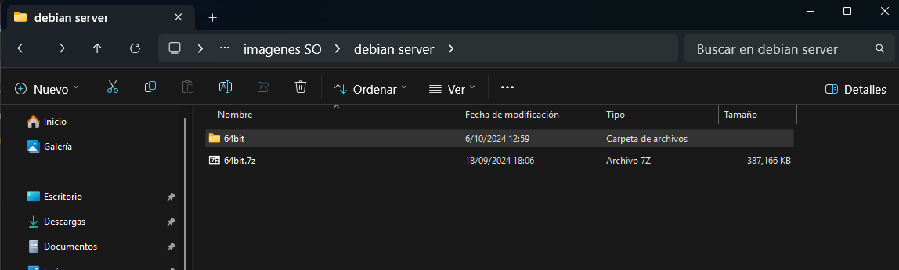
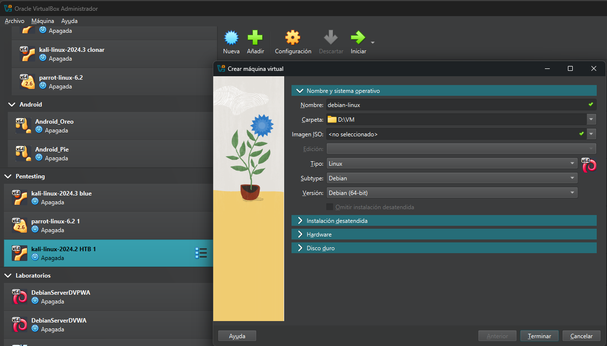
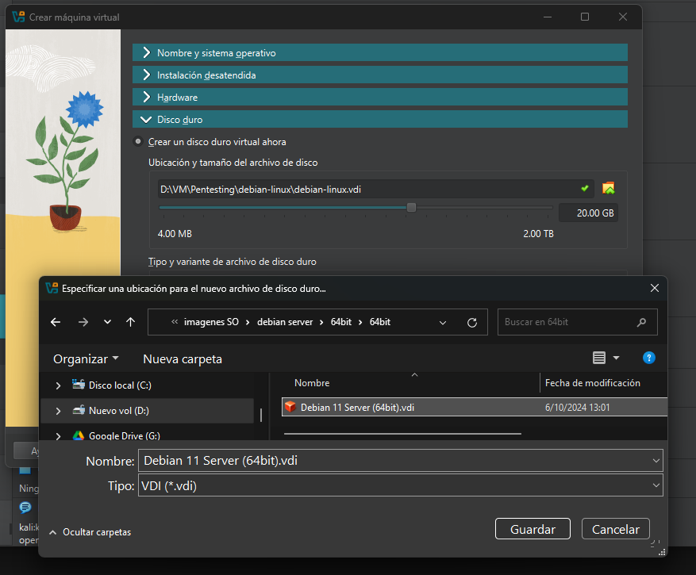

# Virtualización de linux Debian 

## Descargar Virtual Box y Linux Debian
 - Descargar virtual box : https://www.virtualbox.org/wiki/Downloads
 - Descargar Linux Debian : https://www.osboxes.org/debian/

 ## Instalar Linux Debian en VirtualBox

  Dando por supuesto que ya dispones en tu PC de un VirtualBox o un VirtualBox, tan solo tienes que seguir estos pasos:

1. Descargar de la web de OSBoxes la máquina virtual de la distribución Linux que desees (dentro del amplio menú de «sabores» que se te ofrecen) y descomprimir el archivo descargado (es un ZIP) en la carpeta en la que tengas todas tus máquinas virtuales (o donde creas conveniente, claro).

2. Abre VirtualBox y crea una nueva máquina virtual. 

3. Cuando se te pregunte por el disco duro selecciona la última opción “utilizar un fichero de disco virtual existente”; busca el que descargaste y asígnaselo.

3. Arranca tu nueva máquina virtual. Verás que existe un usuario ya creado llamado oxboxes La contraseña es osboxes.org (está indicada en la página de OSBoxes desde donde has descargado tu nueva máquina virtual).