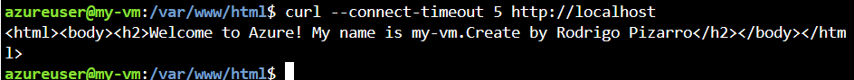

# Laboratorio Cloud Computing 01

## Creación de una máquina virtual Linux

az vm create \
  --resource-group "learn-7e60be08-18d9-47e7-8206-f0da559201d5" \
  --name my-vm \
  --public-ip-sku Standard \
  --image Ubuntu2204 \
  --admin-username azureuser \
  --generate-ssh-keys    

## instalación de Nginx
  az vm extension set \
  --resource-group "learn-7e60be08-18d9-47e7-8206-f0da559201d5" \
  --vm-name my-vm \
  --name customScript \
  --publisher Microsoft.Azure.Extensions \
  --version 2.1 \
  --settings '{"fileUris":["https://raw.githubusercontent.com/MicrosoftDocs/mslearn-welcome-to-azure/master/configure-nginx.sh"]}' \
  --protected-settings '{"commandToExecute": "./configure-nginx.sh"}'    

## Como conectarte a una VM a través de SSH

```
ssh azureuser@<IP_PUBLICA>
```

## Revisar el servicio de NGINX
Ver el estatus del servicio
```
sudo systemctl status nginx
```
Ver si el proceso esta corriendo
```
ps aux | grep nginx
```
Ver si el puerto esta en modo LISTENING

```
sudo netstat -tulnp | grep nginx
```
ó
```
sudo ss -tulnp | grep nginx
```
## En la VM creada, ingresar a la carpeta donde se encuentra el archivo index.html y abrirlo con el siguiente comando:
```
sudo nano index.html
```

<p align="center">

</p>

## Modificar el archivo y agregar su nombre

<p align="center">

</p>

Una vez culminado presionar CTRL+X para salir, le preguntará si desea guardar los cambios y presiones la tecla Y y luego enter.

## Verificar si el cambio esta correctamente ejecutado

<p align="center">

</p>

## Mostrar lista de virtual machine
```
az vm list
```

## Creación de la regla de seguridad de red

az network nsg rule create --resource-group "learn-7e60be08-18d9-47e7-8206-f0da559201d5" --nsg-name my-vmNSG --name allow-http --protocol tcp --priority 100 --destination-port-range 80 --access Allow

## Visualizar de la regla de seguridad de red
az network nsg rule list --resource-group "learn-7e60be08-18d9-47e7-8206-f0da559201d5" --nsg-name my-vmNSG --query '[].{Name:name, Priority:priority, Port:destinationPortRange, Access:access}' --output table


## Obtener Ips de una maquina virtual

```
az vm list-ip-addresses  \
--name my-vm --resource-group learn-1b15e28a-1a68-4407-af6f-0dd2d1fc914f --output table
```

| VirtualMachine | PublicIPAddresses | PrivateIPAddresses |
|----------------|-------------------|--------------------|
|my-vm           | 172.184.177.243   | 10.0.0.4           |

## Visualizar el contenido del servicio web

<p align="center">

</p>

## Sustentos de Laboratorio
Los sustento es un archivo word con las 04 imagenes que se muestran en anteriormente, deberán ser almacenados en la carpeta del GDrive compartido. 
* La ultima imagen debe mostrar el cambio en el navegador, el hostname, y la fecha y hora de tu equipo.


