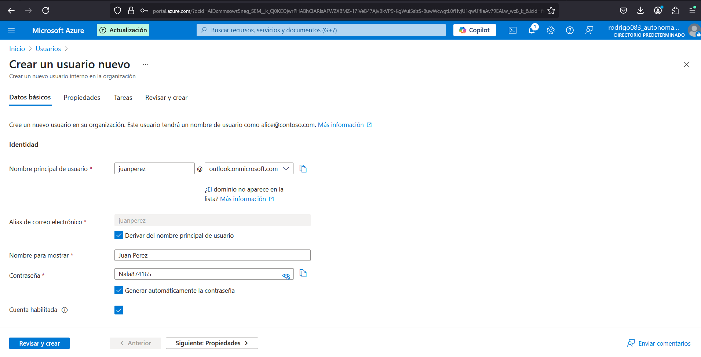

✅ Pasos para crear un usuario en Azure:
Inicia sesión en el portal:
👉 https://portal.azure.com

En el menú lateral, selecciona "Azure Active Directory".

Dentro del panel de Azure AD, haz clic en "Usuarios".

Luego haz clic en "+ Nuevo usuario".

Tienes dos opciones:

Crear usuario: para crear uno nuevo desde cero.

Invitar usuario: si quieres invitar a un usuario externo (B2B) con su correo electrónico.

Si eliges "Crear usuario":

Llena los campos:

Nombre completo

Nombre de usuario (por ejemplo: usuario@tudominio.onmicrosoft.com)

Contraseña inicial (Azure la genera, o puedes asignar una)

Opcionalmente: asigna roles (por ejemplo, usuario, administrador global, etc.)

Haz clic en "Revisar y crear" y luego en "Crear".

