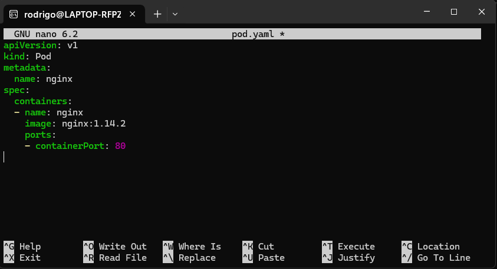

# Instalación de Minikube

## Instalar Minikube

- Antes de empezar, es importante tener en cuenta, que para ejecutar este laboratorio, tu maquina local, debe contar con un procesador que te permita realizar virtualizacación anidada.

- Un punto muy importante es que si tu cuentas con wsl2 o docker instalado en tu maquina, no vas a poder realizar este laboratorio en WMware o Virtual Box, debido a que estos utilizan el Hiper-V, y no te va ha permitir la virtualización anidada en las herramientas mencionadas.

- Este laboratorio lo debes realizar en una maquina con sistema operativo Linux, para este caso nosotros utilizaremos debian, el cual puede estar montado en wsl2, virtualbox o vmware.

- Una vez que ya haz ingresado al sistema operativo, debes ejecutar el siguiente comando:

```
grep -E --color 'vmx|svm' /proc/cpuinfo
```

Esto debe arrojarte una pantalla similar a la siguiente:

<p align="center">

</p>

### Instalación de Kubectl

Para ello debe seguir los siguientes pasos:

```
curl -LO https://storage.googleapis.com/kubernetes-release/release/$(curl -s https://storage.googleapis.com/kubernetes-release/release/stable.txt)/bin/linux/amd64/kubectl
```
```
chmod +x ./kubectl
```
```
sudo mv ./kubectl /usr/local/bin/kubectl
```
Comprobar las configuración del kubectl
```
kubectl version --client
```

Referencia: https://k8s-docs.netlify.app/docs/tasks/tools/install-kubectl/#install-kubectl-on-linux

### Instalación de Docker
```
sudo apt update
sudo apt install -y docker.io
```
Este punto es importante para poder utilizar el driver de docker.

### Instalación de Minikube

```
curl -Lo minikube https://storage.googleapis.com/minikube/releases/latest/minikube-linux-amd64 \
  && chmod +x minikube
```
Aquí hay una manera sencilla de agregar el ejecutable de Minikube a su ruta:

```
sudo mkdir -p /usr/local/bin/
sudo install minikube /usr/local/bin/
```
```
minikube start --vm-driver=docker
```

<p align="center">

</p>

referencia: https://k8s-docs.netlify.app/en/docs/tasks/tools/install-minikube/


### Instalar Podman (OPCIONAL)

En caso tenga problemas con el driver de docker, puede opcionalmente utilizar el Podman

```
sudo apt install podman
```
Abrir el archivo de privilegios del sistema

```
sudo visudo
```

Agregar al final del archivo la siguiente linea:

```
osboxes ALL=(ALL) NOPASSWD: /usr/bin/podman
```
Si no te funciono el driver de docker, puede ejecutar minikube con podman.
```
minikube start --vm-driver=podman
```

# Creación de PODs


## Crear un pod desde linea de Comando

Agregando un pod
```
kubectl run podtest --image=nginx:alpine
```

Mostrar el status del pod

```
kubectl get pods
```

Mostrar el manifiesto del pod

```
kubectl get pod {NOMBRE DEL POD} -o yaml
```

Mostrar la descripción del pod

```
kubectl describe pod {NOMBRE DEL POD}
```

## Crear un pod desde un manifiesto

Primero creamos unas carpetas y el archivo pod.yaml 
```
mkdir kubernetes
cd kubernetes
mkdir pods
nano pod.yamp
```
Una vez abierto el archivo,  copiamos del siguiente enlace : https://kubernetes.io/docs/concepts/workloads/pods/

```
apiVersion: v1
kind: Pod
metadata:
  name: nginx
spec:
  containers:
  - name: nginx
    image: nginx:1.14.2
    ports:
    - containerPort: 80
```


<p align="center">

</p>

Presionamos CTRL+X para cerrar, Y para guardar los cambios y enter para confirmar el nombre.

Luego, Ejecutamos el archivo
```
kubectl apply -f pod.yaml
```


Si deseas saber cuales son todos los tipos de recursos que existen para crear, ejecutamos el siguiente comando:
```
kubectl api-resources
```

## Conexion al pod

Visualizar el servicio web NGINX del POD desde el mismo servidor de debian
```
kubectl port-forward pod/podtest 8080:80
```
abrir otro terminal
```
curl http://localhost:8080
```

<p align="center">

</p>

Visualizar el servicio web NGINX del POD desde tu maquina local
```
kubectl port-forward --address 0.0.0.0 pod/podtest 8080:80
```

Entrar a un navegador y escribir http://localhost:8080

<p align="center">

</p>

### Conectarse al POD

```
kubectl exec -ti podtest -- sh
```

## Crear un pod con dos contenedores

Primero creamos unas carpetas y el archivo doscont.yaml , dentro de la carpeta kubernetes/pods

```
nano doscont.yaml

```

Luego procedemos a copiar lo siguiente:

```
apiVersion: v1
kind: Pod
metadata:
  name: doscont
spec:
  containers:
  - name: contenedor1
    image: python:3.6-alpine
    command: ['sh', '-c', 'echo Hola_Contenedor_1 > index.html && python -m http.server 8082']
  - name: contenedor2
    image: python:3.6-alpine
    command: ['sh', '-c', 'echo Hola_Contenedor_2 > index.html && python -m http.server 8083']
```
Presionamos CTRL+X para cerrar, Y para guardar los cambios y enter para confirmar el nombre.

Luego, Ejecutamos el archivo
```
kubectl apply -f doscont.yaml
```

Revisar los log de un contendor ejecutamos el siguiente comando.

```
kubectl logs doscont -c {NOMBRE_CONTENEDOR}
```

Ingresar a un contenedor

```
kubectl exec -ti doscont -c {NOMBRE_CONTENEDOR} -- sh
```

Instalar curl en el linux alpine
```
apk add -U curl
```

Si deseamos ver la respuesta de la web que esta en el localhost del contenedor, ejecutamos lo siguiente
```
curl localhost:8082
curl localhost:8083
```

### Agregar Etiquetas (LABEL)

Primero creamos unas carpetas y el archivo etiqueta.yaml , dentro de la carpeta kubernetes/pods

```
nano etiqueta.yaml

```

Luego procedemos a copiar lo siguiente:

```
apiVersion: v1
kind: Pod
metadata:
  name: podtest2
  label: 
    app: front
    env: dev
spec:
  containers:
  - name: contenedor1
    image: nginx:1.14.2
    ports:
    - containerPort: 80
---
apiVersion: v1
kind: Pod
metadata:
  name: podtest3
  label: 
    app: backend
    env: dev
spec:
  containers:
  - name: contenedor1
    image: nginx:1.14.2
    ports:
    - containerPort: 80
