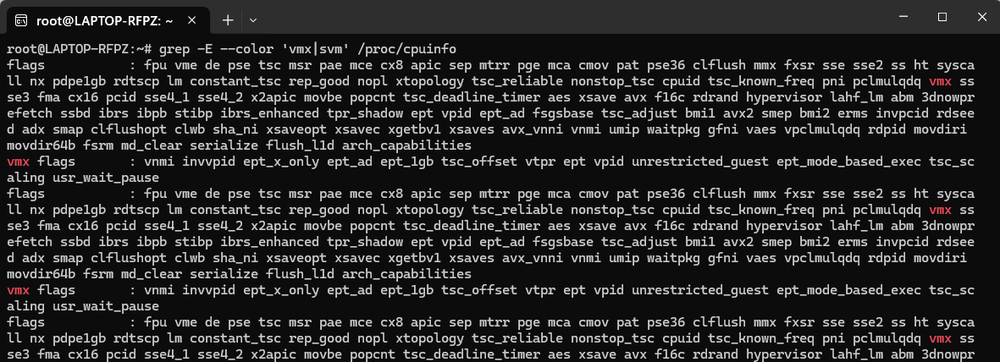
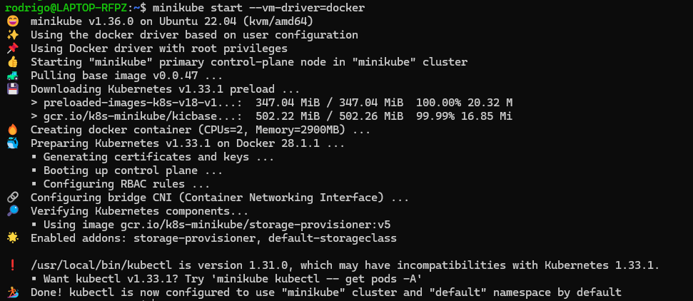
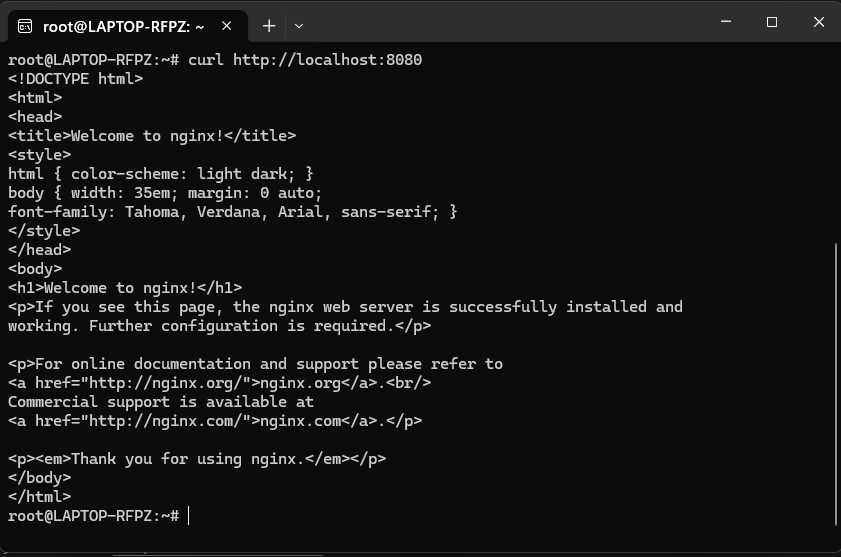
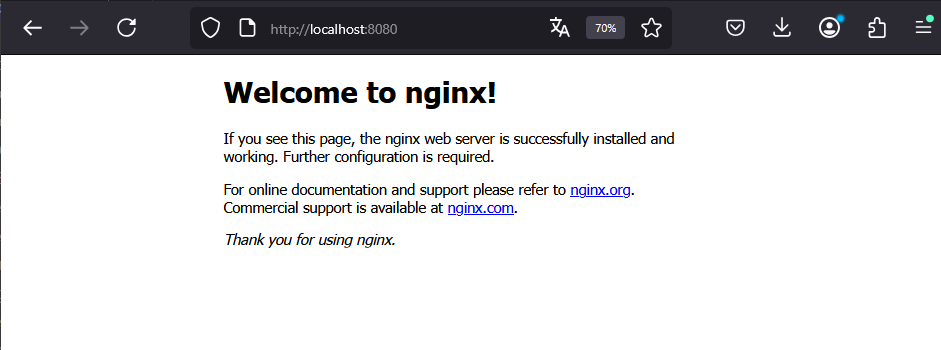

## Instalar Minikube

- Antes de empezar, es importante tener en cuenta, que para ejecutar este laboratorio, tu maquina local, debe contar con un procesador que te permita realizar virtualizacación anidada.

- Un punto muy importante es que si tu cuentas con wsl2 o docker instalado en tu maquina, no vas a poder realizar este laboratorio en WMware o Virtual Box, debido a que estos utilizan el Hiper-V, y no te va ha permitir la virtualización anidada en las herramientas mencionadas.

- Este laboratorio lo debes realizar en una maquina con sistema operativo Linux, para este caso nosotros utilizaremos debian, el cual puede estar montado en wsl2, virtualbox o vmware.

- Una vez que ya haz ingresado al sistema operativo, debes ejecutar el siguiente comando:

```
grep -E --color 'vmx|svm' /proc/cpuinfo
```

Esto debe arrojarte una pantalla similar a la siguiente:

<p align="center">

</p>

### Instalación de Kubectl

Para ello debe seguir los siguientes pasos:

```
curl -LO https://storage.googleapis.com/kubernetes-release/release/$(curl -s https://storage.googleapis.com/kubernetes-release/release/stable.txt)/bin/linux/amd64/kubectl
```
```
chmod +x ./kubectl
```
```
sudo mv ./kubectl /usr/local/bin/kubectl
```
Comprobar las configuración del kubectl
```
kubectl version --client
```

Referencia: https://k8s-docs.netlify.app/docs/tasks/tools/install-kubectl/#install-kubectl-on-linux

### Instalación de Docker
```
sudo apt update
sudo apt install -y docker.io
```
Este punto es importante para poder utilizar el driver de docker.

### Instalación de Minikube

```
curl -Lo minikube https://storage.googleapis.com/minikube/releases/latest/minikube-linux-amd64 \
  && chmod +x minikube
```
Aquí hay una manera sencilla de agregar el ejecutable de Minikube a su ruta:

```
sudo mkdir -p /usr/local/bin/
sudo install minikube /usr/local/bin/
```
```
minikube start --vm-driver=docker
```

<p align="center">

</p>

referencia: https://k8s-docs.netlify.app/en/docs/tasks/tools/install-minikube/


### Instalar Podman (OPCIONAL)

En caso tenga problemas con el driver de docker, puede opcionalmente utilizar el Podman

```
sudo apt install podman
```
Abrir el archivo de privilegios del sistema

```
sudo visudo
```

Agregar al final del archivo la siguiente linea:

```
osboxes ALL=(ALL) NOPASSWD: /usr/bin/podman
```
Si no te funciono el driver de docker, puede ejecutar minikube con podman.
```
minikube start --vm-driver=podman
```

## Crear un pod desde linea de Comando

Agregando un pod
```
kubectl run podtest --image=nginx:alpine
```

Mostrar el status del pod

```
kubectl get pods
```

Mostrar el manifiesto del pod

```
kubectl get pod {NOMBRE DEL POD} -o yaml
```

Mostrar la descripción del pod

```
kubectl describe pod {NOMBRE DEL POD}
```

## Crear un pod desde un manifiesto

Creamos el archivo yaml


Ejecutamos el archivo


## Conexion al pod

Visualizar el servicio web NGINX del POD desde el mismo servidor de debian
```
kubectl port-forward pod/podtest 8080:80
```
abrir otro terminal
```
curl http://localhost:8080
```

<p align="center">

</p>

Visualizar el servicio web NGINX del POD desde tu maquina local
```
kubectl port-forward --address 0.0.0.0 pod/podtest 8080:80
```

Entrar a un navegador y escribir http://localhost:8080

<p align="center">

</p>

### Conectarse al POD

```
kubectl exec -ti podtest -- sh
```